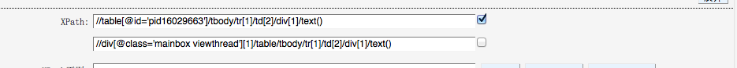

# buzz.user.js使用说明
本脚本只支持firefox，需要安装插件greasemonkey，下载地址: https://addons.mozilla.org/zh-cn/firefox/addon/greasemonkey/  
安装好插件后把本脚本拖到浏览器中，会提示安装， 点击安装即可。

下面用http://bbs.auto.sina.com.cn/22/187/thread-3706995-1-1.html 进行示范。

## xpath部分

1. 唯一性  
  如图：
  input 1  "//table[@id='pid16029663']/tbody/tr[1]/td[2]/div[1]/text()", 包含 "pid16029663", 不能覆盖所有的页面,具有唯一性 
  解决这类问题有两种方法： 
  a. 如果下一个input 不具有唯一性,勾选下一个xpath  
  b. 把唯一性得去掉, "@id='pid16029663'" 变为 "contails(@id, 'pid')",  

2. 浏览器修改html结构
  上图图, 页面得html source本来是没有tbody标签的，这类情况需要在保存前删除掉.

3. 正则表达式用"~" 分隔表达式和结果格式 
  例如： .*?(\d{4}).*?(\d{1,2}).*?(\d{1,2}).*~\1-\2-\3
4. 加双斜杠(//div[@id='main_content']//text())修改属性(//div[@class='pti']/div[2]/em/span/@title) 
5. 字段选择框是自增得

## 网站信息部分
1. 网站UR 
  可以用"___" (3个) 分隔填写多个.

2. URL正则(选填) 
  url正则必须得唯一，写完正则后要检查下是否具有唯一性，如果提示"不匹配任何已有得url"则可。

## 星号字段必填  

另外所有的都应该先测试在保存，在"提交"前必须要先测试全部，否则无法提交。
